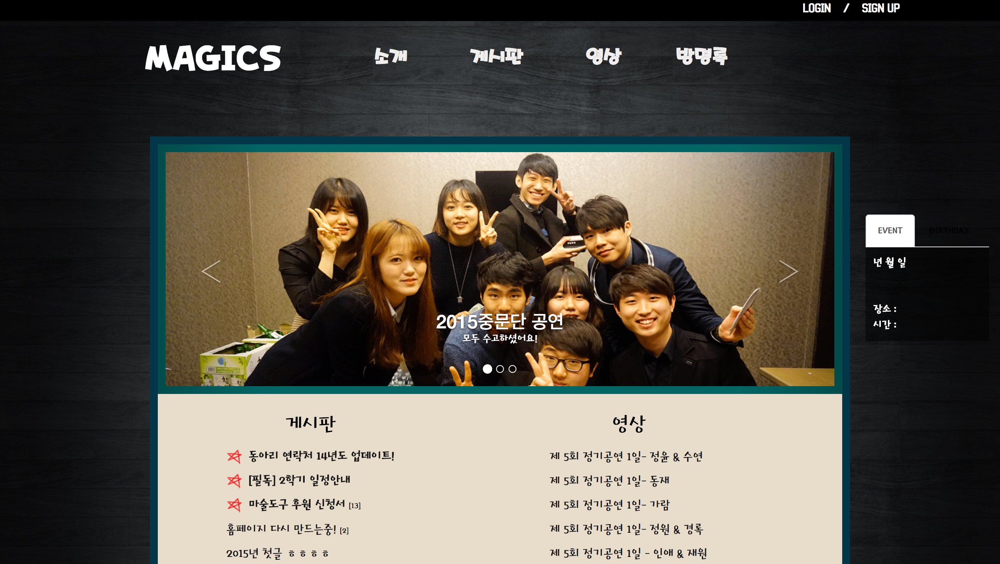

---

## 개요
1. 분류 : 개인프로젝트
2. 개발인원 및 비중도 : 1명 / 100%
3. 역할 : 기획, 디자인, 개발
4. 개발기술 :
	* Front-end : html, css, javascript(jquery)
	* Back-end : php(cafe24 웹호스팅)
	* Design : bootstrap
	* Mobile : jquerymobile, android
5. 상세내역 :
	* WebURL : [http://www.hongikmagics.com/](http://www.hongikmagics.com/)
	* MobileWebURL : [http://www.hongikmagics.com/m/](http://www.hongikmagics.com/m/)
	* Android : [https://play.google.com/store/apps/details?id=service.Dimony.MAGICS](https://play.google.com/store/apps/details?id=service.Dimony.MAGICS)

## Preview

../assets/img/project/hongikmagics_mobile0.png
../assets/img/project/hongikmagics_mobile1.png
../assets/img/project/hongikmagics_mobile2.png


