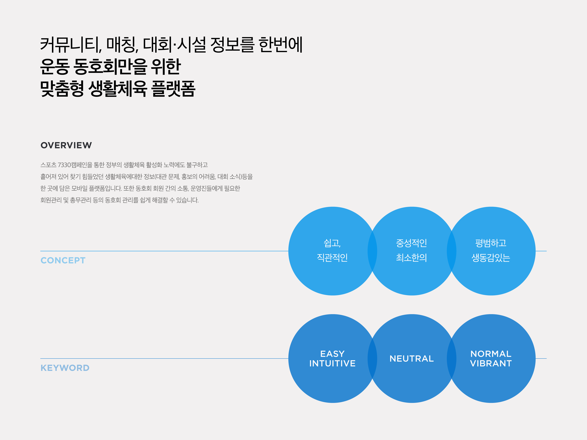
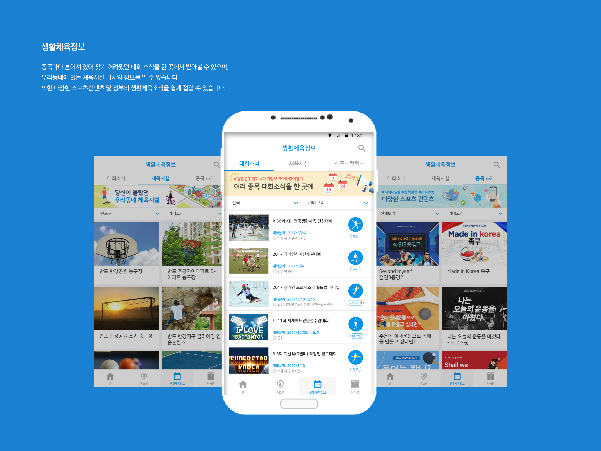
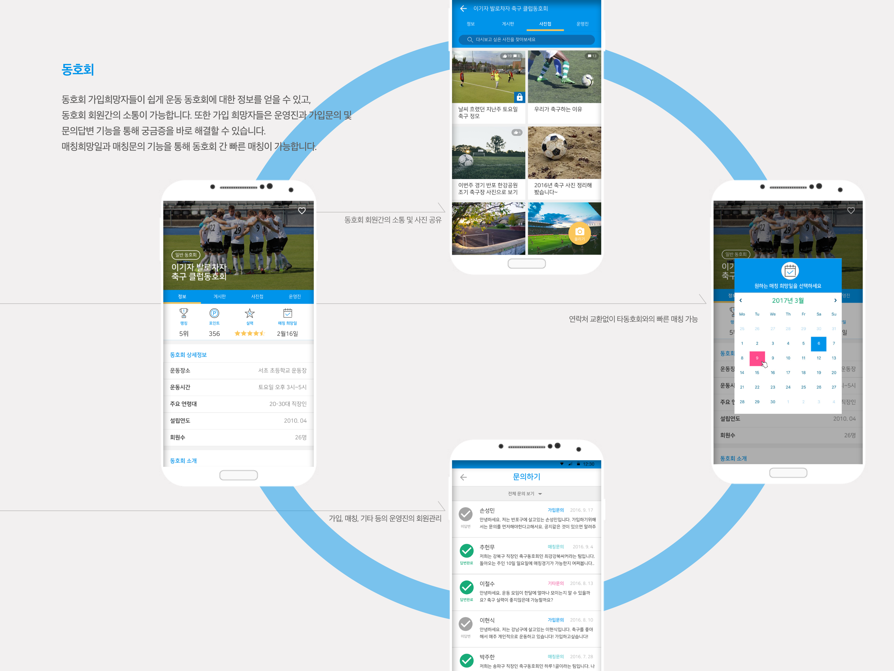

   
  
 

---

## 개요

* 근무처 : SportsFactory
* 발주처 : SportsFactory
* 역할 : 프로젝트 설계 및 개발
* 앱 설명 : 생활체육 통합 플랫폼
* 개발상세내역 :
	- Spring기반 서버 구현
	- Android에서 일부 Native기능 구현
* URL : [GooglePlay](https://play.google.com/store/apps/details?id=com.sportsfactory.sportforall)
* 비고 : 서비스 중

<!-- ## Preview -->

<!--  -->
<!-- 

 -->
